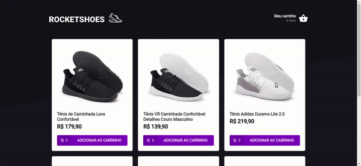
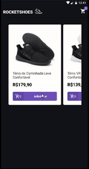

# :shoe: gostack-rocket-shoes
Repository to learn more about redux. It is a little e-commerce of shoes that uses redux to manage the state of the cart, header and other components. It was developed during the 7th bootcamp of Rocketseat.

# :computer: Web preview

# :iphone: Mobile preview

# :fire: Used technologies
- ReactJS
- React Native
- Redux
- Redux Saga
- Styled Components
- Reactotron
- React Navigation
- JavaScript
- Json Server

# :wrench: Running mobile locally
- You must have the react-native enviroment seted up in your machine.
- Run `npm install -g json-server`.
- Enter the mobile directory.
- Run `yarn` or `npm install`.
- In the mobile root direcotry run `json-server server.json -p 3333`.
- Than run `react-native run-android`.
_OBS:_ I wasn't able to set the iOS side of that project because I dont have a MacBook. But you can try it your own and open a pull request if you want.

# :wrench: Running web locally
- You must have the reactjs enviroment seted up in your machine.
- Run `npm install -g json-server`.
- Enter the frontend directory.
- Run `yarn` or `npm install`.
- In the forntend root direcotry run `json-server server.json -p 3333`.
- Than run `yarn start`.
- Access `http://localhost:3000/` in yout browser and see the magic.

# :man: Contributors
- @emilioheinz
